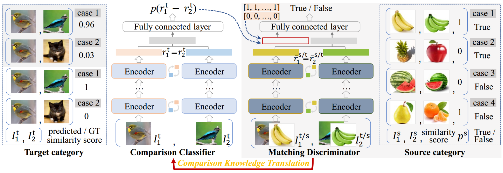

# Comparison Knowledge Translation for Generalizable Image Classification (CCT-Net)

> Official implementation

> [[paper link (ijcai.org)]](https://www.ijcai.org/proceedings/2022/0411.pdf) / [[paper link (arXiv)]](https://arxiv.org/abs/2205.03633)

## Abstract

Deep learning has recently achieved remarkable performance in image classification tasks, which depends heavily on massive annotation. However, the classification mechanism of existing deep learning models seems to contrast to humans' recognition mechanism. With only a glance at an image of the object even unknown type, humans can quickly and precisely find other same category objects from massive images, which benefits from daily recognition of various objects. In this paper, we attempt to build a generalizable framework that emulates the humans' recognition mechanism in the image classification task, hoping to improve the classification performance on unseen categories with the support of annotations of other categories. Specifically, we investigate a new task termed Comparison Knowledge Translation (CKT). Given a set of fully labeled categories, CKT aims to translate the comparison knowledge learned from the labeled categories to a set of novel categories. To this end, we put forward a Comparison Classification Translation Network (CCT-Net), which comprises a comparison classifier and a matching discriminator. The comparison classifier is devised to classify whether two images belong to the same category or not, while the matching discriminator works together in an adversarial manner to ensure whether classified results match the truth. Exhaustive experiments show that CCT-Net achieves surprising generalization ability on unseen categories and SOTA performance on target categories.



## Requirements

To install requirements:

```bash
pip install -r requirements.txt
```

## Dataset Preparation
It is quite convenient to prepare benchmark datasets or custom datasets by following these steps:
Firstly, make each dataset in a unified **imagefolder** format:
```
├── dataset
│   ├── class_1
│   │   ├── image_1
│   │   ├── image_2
│   │   ├── ...
│   ├── class_2
│   ├── class_3
│   ├── ...
```
Then, add all the category names into `classes.py`.
After that, use the APIs in `utils/make_datasets.py` to convert the original imagefolder to what we need, including source, target (labelled and unlabelled), validation, and test dataset. 

## Training

To train the CCT-Net, run `dist_train_gan.py`.

Arguments:
`--local_rank`: system automatic allocation
`--device`: default: 'cuda'
`--batch-size`
`--epochs`
`--g-steps`: steps of the comparison classifier in each iteration
`--d-steps`: steps of the matching discriminator in each iteration
`--g-fs-tgt-steps`: steps of the comparison classifier for labelled target samples in each iteration
`--lr`: learning rate
`--lrf`: final learning rate, for cosine annealing
`--eval-interval`
`--unsup`: whether to use the unsupervised mechanism
`--data-root`: e.g. ./datasets/
`--dataset`: e.g. mini-imagenet
`--sub`: sub-dataset for different tasks e.g. src50-tgt50, 20-shot-src50-tgt50
`--fs`: whether to train few-shot target, action="store_true"
`--g-weights`: e.g. ./weights/latest.pth
`--d-weights`: same as `--g-weights`
`--do-not-save`: action="store_true"
`--saving-interval`
`--remarks`: to take a note

For example,
```bash
CUDA_VISIBLE_DEVICES=0,1,2,3 python -m torch.distributed.launch --nproc_per_node=4 dist_train_gan.py --batch-size 8 --dataset mini-imagenet --sub 20-shot-src50-tgt50 --epochs 100 --g-weights ./weights/latest.pth --g-fs-tgt-steps 0 --g-steps 3
```
<br/>
To train the Comparison Classifier part, run `dist_train_g.py`

Arguments:
`--local_rank`: system automatic allocation
`--device`: default: 'cuda'
`--batch-size`
`--epochs`
`--lr`: learning rate
`--lrf`: final learning rate, for cosine annealing
`--eval-interval`
`--unsup`: whether to use the unsupervised mechanism
`--data-root`: e.g. ./datasets/
`--dataset`: e.g. mini-imagenet
`--sub`: sub-dataset for different tasks e.g. src50-tgt50, 20-shot-src50-tgt50
`--fs`: whether to train few-shot target, action="store_true"
`--g-weights`: e.g. ./weights/latest.pth
`--do-not-save`: action="store_true"
`--saving-interval`
`--remarks`: to take a note

For example,
```bash
CUDA_VISIBLE_DEVICES=0,1,2,3 python -m torch.distributed.launch --nproc_per_node=4 dist_train_g.py --batch-size 8 --dataset mini-imagenet --sub 20-shot-src50-tgt50 --epochs 100 --g-weights ./weights/latest.pth --lr 1e-4 --fs
```

## Evaluation

To evaluate the CCT-Net, run `dist_test_gan.py`:

Arguments:
`--local_rank`: system automatic allocation
`--device`: default: 'cuda'
`--batch-size`
`--num-shot`: number of representatives in each category
`--data-root`: e.g. ./datasets/
`--dataset`: e.g. mini-imagenet
`--g-weights`: e.g. ./weights/latest.pth
`--id`: checkpoint id, expressed as a datetime

For example,
```bash
CUDA_VISIBLE_DEVICES=1,3 python -m torch.distributed.launch --nproc_per_node=2 dist_test_gan.py --batch-size 30 --dataset mini-imagenet --id 01-14_17-41-03 --num-shot 30
```
```bash
CUDA_VISIBLE_DEVICES=0,1 python -m torch.distributed.launch --nproc_per_node=2 dist_test_gan.py --batch-size 30 --dataset mini-imagenet --g-weights ./weights/latest.pth --num-shot 30
```